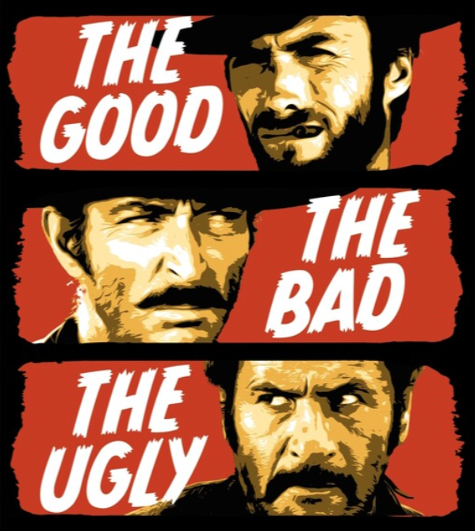
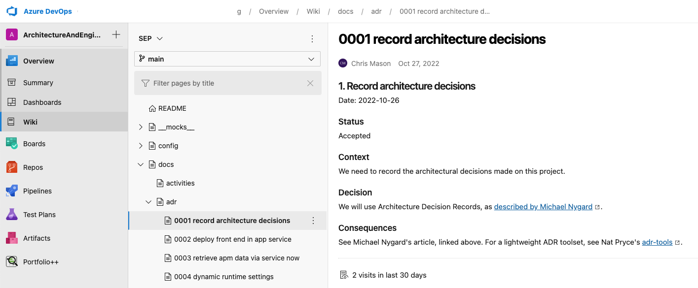

# ADRs

## Answering the "Why" in Future WTFs

---
# WTF is an ADR?

* Architecture
* Decision
* Record

<!--
Architecture
Decision
Record

We take an agile approach when developing our projects. We should take a similar agile approach to documenting them. You can think of ADRs as a collection of records for "architecturally significant" decisions.

Why a certain implementation was chosen over another...
Why certain dependencies are needed, etc.

Each ADR will be stored as a separate text document in the repository next to the source. This greatly increases the chances that the documents will be read and kept up to date.
-->

---
# ADR Components

1. Title
2. Status
3. Context
4. Decision
5. Consequences

<!--
ADRs have just a few components to them so they can be easily read and digested. Ideally documents are written in markdown to allow for fancy formatting while keeping the source very readable.
-->

---
# Title

- Prefixed with a sequential number
- Just a short phrase

### Example:
*2. deploy front end in app service*
File name: `0002-deploy-front-end-in-app-service.md`

---
# Status

- Proposed
- Accepted
- Superseded

<!--
Proposed: decisions that don't yet have agreement by the stakeholders
Accepted: has been agreed upon by the stakeholders
Superseded: this decision was changed or reversed by a later ADR. Should be a link to the replacement.
--->

---
# Context

- Describes the forces at play
- Could be technical, political, social, etc.
- Very likely opposing forces
- Keep language value-neutral
- You're stating facts, not passing judgment

---
# Decision

- Describe the action taken
- Use complete sentences
- Use an active voice
- "We will use Architecture Decision Records."

---
# Consequences

- Positive
- Neutral
- Negative

<!--
This section describes the resulting context, after applying the decision. All consequences should be listed here, not just the "positive" ones. A particular decision may have positive, negative, and neutral consequences, but all of them affect the team and project in the future.

Keep records on the small side, no more than a page or two.
-->

---
# How ADRs Look in Azure DevOps

---
# Resources

## Documenting Architecture Decisions - Michael Nygard

### https://cognitect.com/blog/2011/11/15/documenting-architecture-decisions

## ADR Tools

### https://github.com/npryce/adr-tools

- MacOS X
- Linux
- Windows

---

# Thank you

## Questions?

<!--
footer: Slides available at https://github.com/cmason/adr
-->
